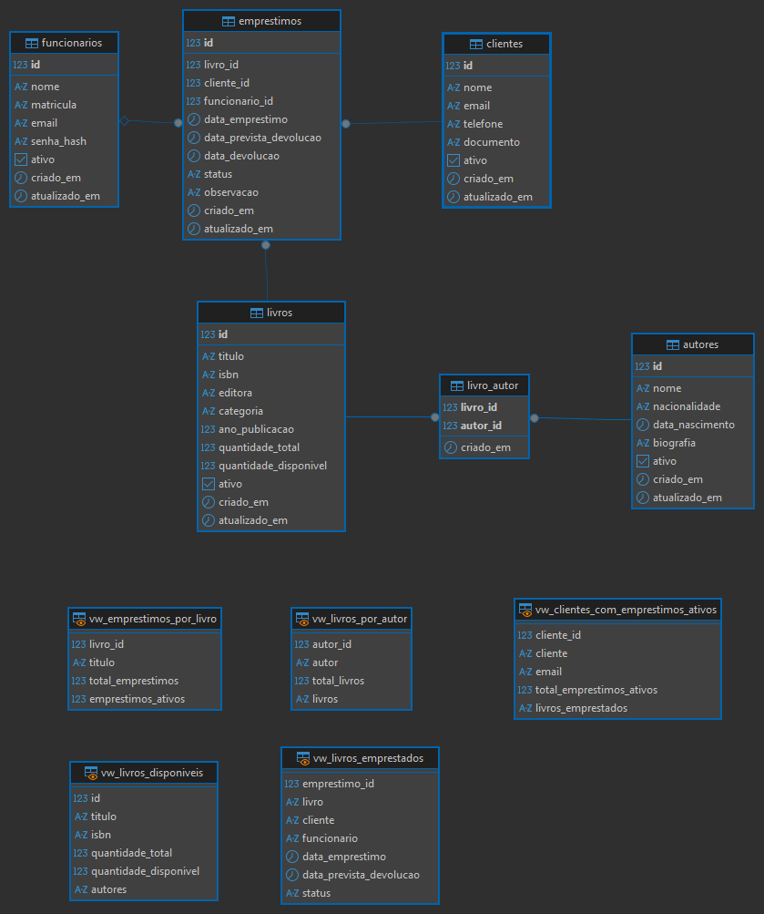
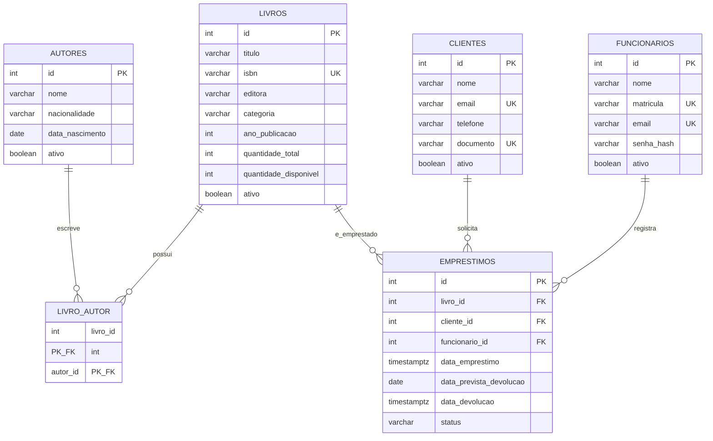

# BookStore Manager CLI

Aplicacao de linha de comando em **Node.js + TypeScript** para gerenciar uma livraria, com persistencia em **PostgreSQL** e **SQL nativo** — sem ORM e sem query builder.

Projeto final avaliativo do Modulo 01 — Desenvolvedor(a) Back End Node (SENAI/SCTECH).
O enunciado e a rubrica originais estao preservados em [docs/enunciado-e-rubrica.md](docs/enunciado-e-rubrica.md).

---

## Sumario

1. [Funcionalidades](#funcionalidades)
2. [Arquitetura](#arquitetura)
3. [Modelagem do banco](#modelagem-do-banco)
4. [Instalacao](#instalacao)
5. [Execucao](#execucao)
6. [Exemplos reais de execucao](#exemplos-reais-de-execucao)
7. [Testes automatizados](#testes-automatizados)
8. [Decisoes tecnicas](#decisoes-tecnicas)
9. [Scripts disponiveis](#scripts-disponiveis)
10. [Estrutura de pastas](#estrutura-de-pastas)

---

## Funcionalidades

| Modulo           | Operacoes                                                                                                                          |
| ---------------- | ---------------------------------------------------------------------------------------------------------------------------------- |
| **Autores**      | cadastrar, listar, consultar por ID, atualizar, remover                                                                            |
| **Livros**       | cadastrar (com vinculo N:N de autores), listar, consultar, atualizar, remover                                                      |
| **Clientes**     | cadastrar, listar, consultar, atualizar, remover                                                                                   |
| **Emprestimos**  | registrar, devolver, listar em aberto, listar todos, consultar                                                                     |
| **Funcionarios** | cadastrar (senha derivada com scrypt), listar, consultar, atualizar, remover                                                       |
| **Relatorios**   | livros disponiveis, livros emprestados, livros por autor, emprestimos por livro, clientes com emprestimos ativos, top 5 categorias |

Todas as remocoes sao **logicas** (`ativo = FALSE`): o historico permanece integro e nenhum registro referenciado por emprestimo e apagado.

---

## Arquitetura

O fluxo de uma operacao atravessa sempre as mesmas camadas, em uma unica direcao:

```
CLI / Menu  ->  Controller  ->  Service  ->  Repository  ->  PostgreSQL
```

| Camada          | Responsabilidade                                 | Nao pode                  |
| --------------- | ------------------------------------------------ | ------------------------- |
| `menus/`        | desenhar o menu e rotear a opcao escolhida       | conhecer regra de negocio |
| `controllers/`  | ler entrada do terminal e formatar a saida       | conhecer SQL              |
| `services/`     | regra de negocio, validacoes e erros previsiveis | conhecer o terminal       |
| `repositories/` | SQL parametrizado e acesso ao pool               | conhecer regra de negocio |
| `models/`       | interfaces, tipos e mapeamento linha -> objeto   | ter efeito colateral      |
| `database/`     | pool de conexao, `schema.sql`, `seed.sql`        | —                         |
| `utils/`        | funcoes reutilizaveis e puras                    | —                         |

As dependencias sao montadas por **injecao via construtor** em [src/main.ts](src/main.ts): o repository recebe o pool, o service recebe o repository, o controller recebe o service. Nenhuma classe abre a propria conexao.

> O template do professor (`src/@common`, `src/usecase`, `src/view`) foi preservado no repositorio. A aplicacao foi construida nas camadas que o RF04 exige, adaptando a base existente em vez de descarta-la.

---

## Modelagem do banco

Seis tabelas, com a relacao **N:N** entre livros e autores resolvida pela associativa `livro_autor`.



_Diagrama gerado no DBeaver a partir do banco criado por [src/database/schema.sql](src/database/schema.sql). Abaixo, o mesmo modelo em Mermaid, para leitura direta no GitHub._



### Integridade garantida no banco

O modelo nao depende da aplicacao para se manter consistente:

- **CHECK** — `quantidade_disponivel >= 0 AND <= quantidade_total`; ISBN com 10 ou 13 digitos; ano entre 1000 e 2100; email validado por expressao regular; documento entre 11 e 14 digitos; `status` restrito a `ATIVO`, `DEVOLVIDO` e `ATRASADO`.
- **UNIQUE** — ISBN, email e documento de cliente, matricula e email de funcionario. O nome do autor usa **indice unico parcial** (`WHERE ativo = TRUE`), porque nome nao identifica uma pessoa: apos a remocao logica o nome volta a ficar livre.
- **ON DELETE** — `RESTRICT` onde apagar quebraria historico (livro e cliente de um emprestimo), `CASCADE` no vinculo `livro_autor`, `SET NULL` no funcionario de um emprestimo.
- **TRIGGERS** — a baixa e a reposicao de exemplares acontecem no banco. Inserir um emprestimo desconta um exemplar e, se nao houver disponivel, levanta excecao e o insert nao acontece. Marcar como `DEVOLVIDO` carimba a data e devolve o exemplar ao acervo.

Detalhamento completo em [docs/modelagem-banco.md](docs/modelagem-banco.md) e no DDL em [src/database/schema.sql](src/database/schema.sql).

---

## Instalacao

### Pre-requisitos

- Node.js 20 ou superior
- PostgreSQL 14 ou superior em execucao

### Passos

```bash
git clone https://github.com/LucasR0sa/sctec-projeto1.git
cd sctec-projeto1
npm install
```

Crie o banco (uma unica vez), conectado ao banco padrao `postgres`:

```sql
CREATE DATABASE bookstore_manager;
```

Copie o modelo de variaveis de ambiente e ajuste a senha:

```bash
cp .env.example .env
```

```env
DB_HOST=localhost
DB_PORT=5432
DB_NAME=bookstore_manager
DB_USER=postgres
DB_PASSWORD=sua_senha
```

> O `.env` **nao** e versionado. Apenas o `.env.example` vai para o repositorio.

Crie as tabelas e carregue os dados iniciais:

```bash
npm run db:reset
```

```text
> tsx src/database/run-sql.ts src/database/schema.sql src/database/seed.sql

Executando src/database/schema.sql...
src/database/schema.sql executado com sucesso.
Executando src/database/seed.sql...
src/database/seed.sql executado com sucesso.
```

Os dois scripts sao **idempotentes**: podem ser reexecutados a qualquer momento. O `schema.sql` recria as tabelas do zero, entao reexecuta-lo descarta os dados existentes.

---

## Execucao

```bash
npm run dev
```

```text
========================================
       BookStore Manager CLI
========================================
1. Autores
2. Livros
3. Clientes
4. Emprestimos
5. Funcionarios
6. Relatorios
0. Encerrar aplicacao
Escolha uma opcao:
```

Para encerrar, escolha `0` no menu principal. O pool de conexoes e fechado em um bloco `finally`, entao o processo termina sozinho — sem `Ctrl+C`.

---

## Exemplos reais de execucao

Saidas capturadas com o banco no estado do `seed.sql` (`npm run db:reset`).

### Listar autores

```text
Autores cadastrados
2 | Clarice Lispector | Brasileira
3 | George Orwell | Britanica
1 | Machado de Assis | Brasileira
4 | Robert C. Martin | Estadunidense
```

A ordenacao e por nome, nao por ID — por isso os IDs aparecem fora de sequencia.

### Listar livros

```text
Livros cadastrados
3 | 1984 | George Orwell | 3/4 disponiveis
2 | A Hora da Estrela | Clarice Lispector | 2/2 disponiveis
4 | Clean Code | Robert C. Martin | 2/2 disponiveis
1 | Dom Casmurro | Machado de Assis | 3/3 disponiveis
```

Os autores de cada livro vem agregados na mesma consulta, com `LEFT JOIN` e `ARRAY_AGG` — nao ha consulta adicional por livro.

O `1984` aparece com 3 de 4 exemplares porque o seed ja registra um emprestimo ativo, e o trigger baixou o estoque.

### Cadastrar livro com dois autores (N:N em transacao)

```text
Cadastro de livro
Titulo: O Cortico
ISBN (10 ou 13 digitos): 9788526012006
Editora: Atica
Categoria: Romance
Ano de publicacao: 1890
Quantidade total: 3
IDs dos autores (separados por virgula): 1, 3
Livro cadastrado com sucesso. ID: 5
```

### Registrar emprestimo

```text
Registro de emprestimo
ID do livro: 3
ID do cliente: 2
ID do funcionario (opcional): 1
Prazo em dias (padrao 7): 7
Observacao: Retirada no balcao
Emprestimo registrado com sucesso. ID: 2
Devolucao prevista para 2026-08-07.
```

### Listar emprestimos em aberto

```text
Emprestimos em aberto
1 | 1984 | Beatriz Lima | 2026-07-31 | ATIVO
2 | 1984 | Carlos Souza | 2026-07-31 | ATIVO
```

### Registrar devolucao

```text
ID do emprestimo a devolver: 2
ID: 2
Livro: 1984
Cliente: Carlos Souza
Funcionario: Lucas Rosa
Data do emprestimo: 2026-07-31
Devolucao prevista: 2026-08-07
Data da devolucao: Em aberto
Status: ATIVO
Observacao: Retirada no balcao
Confirmar devolucao? (s/n): s
Devolucao registrada com sucesso.
O exemplar de "1984" voltou para o acervo.
```

### Relatorios

```text
=== Livros disponiveis ===
3 | 1984 | George Orwell | 2 de 4 disponiveis
2 | A Hora da Estrela | Clarice Lispector | 2 de 2 disponiveis
4 | Clean Code | Robert C. Martin | 2 de 2 disponiveis
1 | Dom Casmurro | Machado de Assis | 3 de 3 disponiveis
5 | O Cortico | George Orwell, Machado de Assis | 3 de 3 disponiveis
```

```text
=== Clientes com emprestimos ativos ===
Beatriz Lima | beatriz@email.com | 1 em aberto | 1984
Carlos Souza | carlos@email.com | 1 em aberto | 1984
```

```text
=== Top 5 categorias do acervo ===
Romance | 3 titulo(s) | 8 de 8 exemplares disponiveis
Distopia | 1 titulo(s) | 2 de 4 exemplares disponiveis
Tecnologia | 1 titulo(s) | 2 de 2 exemplares disponiveis
```

### Tratamento de erros

A aplicacao nunca interrompe a execucao diante de entrada invalida: exibe a mensagem e volta ao menu.

**Entrada invalida — barrada antes de chegar ao banco:**

```text
ID do autor: abc
ID deve ser um numero inteiro positivo.
```

**Registro inexistente:**

```text
ID do autor: 9999
Autor nao encontrado.
```

**Duplicidade:**

```text
Cadastro de livro
Titulo: Duplicado
ISBN (10 ou 13 digitos): 9788526012006
Editora:
Categoria:
Ano de publicacao:
Quantidade total: 1
IDs dos autores (separados por virgula): 1
Ja existe um livro cadastrado com esse ISBN.
```

**Regra de negocio — cliente ja com o mesmo livro em maos:**

```text
Registro de emprestimo
ID do livro: 3
ID do cliente: 1
ID do funcionario (opcional):
Prazo em dias (padrao 7):
Observacao:
Este cliente ja possui um emprestimo ativo deste livro.
```

**Referencia inexistente:**

```text
Registro de emprestimo
ID do livro: 1
ID do cliente: 9999
ID do funcionario (opcional):
Prazo em dias (padrao 7):
Observacao:
Cliente nao encontrado.
```

**Politica de senha:**

```text
Cadastro de funcionario
Nome: Novo Operador
Matricula: FUNC-003
Email: novo@bookstore.local
Senha (minimo 6 caracteres): 123
Senha deve ter pelo menos 6 caracteres.
```

---

## Testes automatizados

```bash
npm run db:reset   # deixa o banco no estado do seed
npm test
```

```text
> tsx --test src/__tests__/*.test.ts

▶ Regra de disponibilidade em emprestimo e devolucao
  ✔ recusa emprestimo de livro inexistente
  ✔ recusa emprestimo para cliente inexistente
  ✔ recusa identificador que nao seja inteiro positivo
  ✔ baixa um exemplar ao registrar o emprestimo
  ✔ recusa emprestimo sem exemplar disponivel
  ✔ mantem o estoque intacto depois da tentativa recusada
  ✔ recusa o mesmo livro para o mesmo cliente duas vezes
  ✔ devolve o exemplar ao acervo e carimba a data
  ✔ recusa devolver duas vezes o mesmo emprestimo
  ✔ recusa devolucao de emprestimo inexistente
✔ Regra de disponibilidade em emprestimo e devolucao

ℹ tests 10
ℹ pass 10
ℹ fail 0
```

Os testes usam o **runner nativo do Node** (`node:test`), sem adicionar nenhuma dependencia ao projeto.

Sao testes de **integracao**, propositalmente: a regra de disponibilidade e cumprida em conjunto pela aplicacao e pelo PostgreSQL — validacao no service, garantia no trigger e na constraint. Um mock do repository provaria apenas que o mock funciona. Cada execucao cria seu proprio livro de teste com um unico exemplar (o cenario que expoe a regra) e limpa os dados ao final.

---

## Decisoes tecnicas

### Queries parametrizadas, sempre

Todo valor vindo do usuario viaja como parametro (`$1`, `$2`), nunca concatenado na string SQL. Isso elimina a superficie de SQL injection.

```ts
const { rows } = await this.pool.query<AutorRow>(
  `SELECT ${AUTHOR_COLUMNS}
     FROM autores
    WHERE LOWER(TRIM(nome)) = LOWER(TRIM($1))
      AND ativo = TRUE`,
  [nome]
)
```

### Transacoes onde a atomicidade importa

Gravar um livro sao duas operacoes: inserir em `livros` e inserir os vinculos em `livro_autor`. Se a segunda falhasse, restaria um livro sem autor — invisivel no relatorio de disponiveis, que usa `JOIN livro_autor`. As duas rodam em `BEGIN`/`COMMIT`, com `ROLLBACK` em qualquer falha.

No emprestimo ha um cuidado extra: antes de inserir, o repository executa `SELECT ... FOR UPDATE` na linha do livro. Sem esse bloqueio, dois atendentes retirando o ultimo exemplar simultaneamente leriam `quantidade_disponivel = 1` ao mesmo tempo e o acervo ficaria negativo.

### Regra de negocio em dois niveis

A disponibilidade e validada no service — para a mensagem ao usuario ser clara — **e** garantida por trigger no banco — para o dado nunca ficar inconsistente, mesmo se outra aplicacao escrever na tabela. Validar da a boa mensagem; a constraint da a garantia.

### Erro de negocio separado de erro tecnico

Falhas previsiveis viram `DomainError` e chegam ao usuario como uma frase. Qualquer outra excecao cai no ramo de erro inesperado. E a mesma distincao que uma API usa para decidir entre responder 400 ou 500.

Violacoes de constraint do PostgreSQL sao traduzidas para `DomainError` pelo codigo SQLSTATE (`23505` unicidade, `23503` chave estrangeira, `P0001` excecao de trigger). Isso cobre a condicao de corrida entre a verificacao previa e a gravacao.

### Remocao logica com semantica por campo

Nem todo identificador deve ser reciclado apos a remocao:

- **Nome de autor** volta a ficar disponivel — duas pessoas podem ter o mesmo nome, entao o indice unico e parcial (`WHERE ativo = TRUE`).
- **Email, documento e matricula** seguem reservados — identificam uma pessoa real, e liberar permitiria que um cadastro novo herdasse a identidade de um antigo. A mensagem informa o ID do cadastro inativo, para o usuario nao procurar em vao na listagem.

### Senha sem dependencia externa

A senha do funcionario e derivada com **scrypt** do modulo nativo `node:crypto`, com salt aleatorio por registro, guardada como `salt:hash`. A verificacao usa `timingSafeEqual`, que nao vaza informacao pelo tempo de resposta. O hash nunca e projetado nas consultas de leitura.

### Encerramento sem vazar conexoes

O `pool.end()` roda em `finally`, entao acontece mesmo se a aplicacao falhar no meio. Conexoes vazadas consomem slots do `max_connections` do servidor e afetam todos os sistemas conectados, nao so este.

---

## Scripts disponiveis

| Comando                | O que faz                                        |
| ---------------------- | ------------------------------------------------ |
| `npm run dev`          | executa a CLI em modo desenvolvimento (`tsx`)    |
| `npm run build`        | compila o TypeScript para `dist/`                |
| `npm test`             | testes de integracao com o runner nativo do Node |
| `npm start`            | executa a versao compilada                       |
| `npm run db:schema`    | cria o esquema do banco                          |
| `npm run db:seed`      | carrega os dados iniciais                        |
| `npm run db:reset`     | executa schema e seed em sequencia               |
| `npm run lint`         | ESLint com `strictTypeChecked`                   |
| `npm run format`       | aplica Prettier                                  |
| `npm run format:check` | verifica formatacao sem alterar arquivos         |

---

## Estrutura de pastas

```text
src/
├── main.ts                  # ponto de entrada: monta as dependencias
├── controllers/             # interacao com o terminal
├── services/                # regras de negocio
├── repositories/            # SQL parametrizado
├── models/                  # interfaces, tipos e mapeamento de linhas
├── menus/                   # menus navegaveis da CLI
├── database/                # pool, schema.sql, seed.sql, executor de SQL
├── utils/                   # Cli, DomainError, validacoes, senha
├── __tests__/               # testes de integracao das regras de emprestimo
└── @common/ usecase/ view/  # template original do professor (preservado)
docs/                        # enunciado, rubrica, modelagem, guia do DBeaver e diagramas
```

`src/` contem apenas codigo-fonte (`.ts`) e os scripts SQL da aplicacao. Toda a documentacao fica em `docs/`.

---

## Tecnologias

| Dependencia | Uso                                    |
| ----------- | -------------------------------------- |
| `pg`        | driver PostgreSQL com pool de conexoes |
| `dotenv`    | leitura das variaveis de ambiente      |

Dependencias de desenvolvimento: TypeScript (strict mode), `tsx`, ESLint (`strictTypeChecked`), Prettier.

Nenhuma outra dependencia de runtime — sem ORM, sem query builder, sem biblioteca de CLI.

---

## Autor

**Lucas Rosa** — [github.com/LucasR0sa](https://github.com/LucasR0sa)
