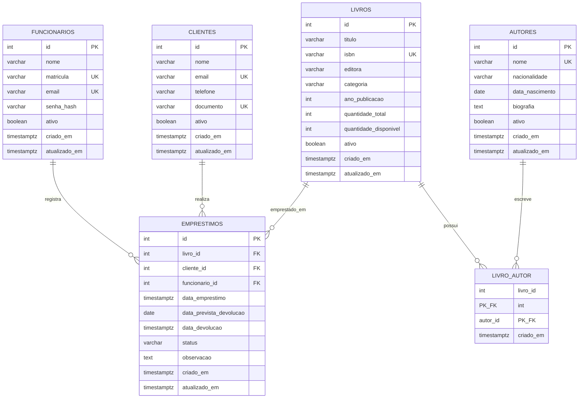

# Modelagem do Banco de Dados

Este modelo foi desenhado para o BookStore Manager CLI usando PostgreSQL, SQL nativo e arquitetura em camadas.

## Decisoes principais

- `livros` e `autores` possuem relacionamento N:N por meio de `livro_autor`.
- `emprestimos` registra o historico de retirada e devolucao de livros por clientes.
- `funcionarios` identifica o operador que registrou o emprestimo, ajudando na auditoria e na apresentacao em video.
- `quantidade_total` e `quantidade_disponivel` ficam em `livros`, com `CHECK` garantindo que a disponibilidade nunca seja negativa nem maior que o total.
- Triggers protegem a regra central do negocio: emprestar baixa a disponibilidade; devolver aumenta a disponibilidade.
- Views foram criadas para apoiar os relatorios exigidos no RF18.

## Diagrama ER

## Regras de integridade

- `funcionarios.matricula`, `funcionarios.email`, `clientes.email`, `clientes.documento` e `livros.isbn` sao unicos.
- `autores.nome` possui indice unico normalizado com `LOWER(TRIM(nome))`.
- `livro_autor` usa chave primaria composta para impedir autor repetido no mesmo livro.
- `emprestimos.status` aceita apenas `ATIVO`, `DEVOLVIDO` ou `ATRASADO`.
- Um cliente nao pode ter dois emprestimos ativos ou atrasados do mesmo livro ao mesmo tempo.
- Um emprestimo devolvido deve possuir `data_devolucao`.

## Relatorios ja suportados por views

- `vw_livros_disponiveis`
- `vw_livros_emprestados`
- `vw_livros_por_autor`
- `vw_emprestimos_por_livro`
- `vw_clientes_com_emprestimos_ativos`

## Uso no DBeaver

O roteiro de criacao do banco, execucao dos scripts e exportacao do diagrama ER esta em [`docs/dbeaver.md`](./dbeaver.md).

A imagem exportada pelo DBeaver deve ser salva preferencialmente em `docs/modelagem-bookstore.png` e referenciada no README.
