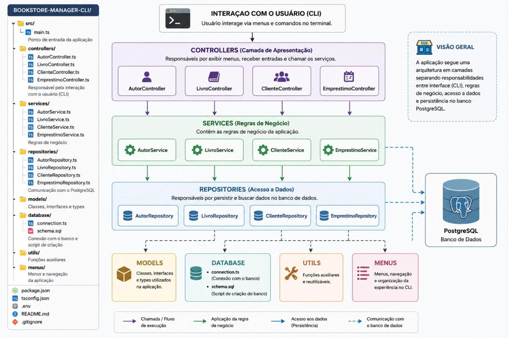
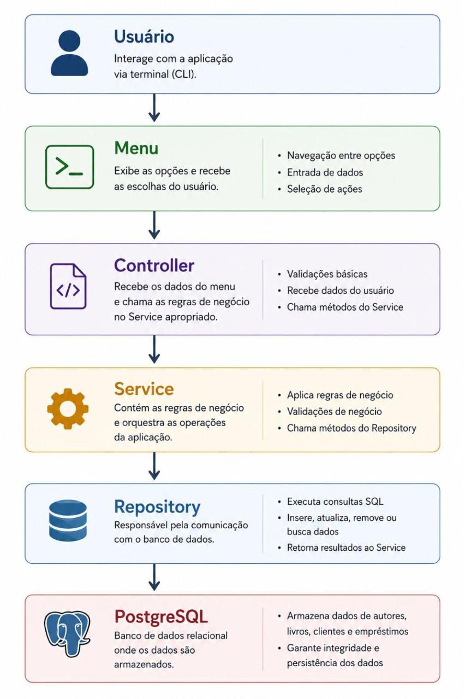

# Projeto Avaliativo — Back End Node T1 e T2 — M1S13

> **Captura integral do enunciado oficial.**
> Fonte 1 (documento do professor): https://docs.google.com/document/d/1BQUlTOQgb2xtTmZTVOgQ5f0SSpCFr75IBgfg_wnn88U/edit
> Fonte 2 (repo do professor): https://github.com/marcomoura-senai/sctec-projeto1
> Capturado em: 30/07/2026

---

## Dados da entrega no AVA (conferidos na página da tarefa)

| Campo               | Valor                                                                   |
| ------------------- | ----------------------------------------------------------------------- |
| Curso               | Fundamentos para Back-end: JavaScript, TypeScript e PostgreSQL — 505682 |
| Tarefa              | Projeto Avaliativo - Módulo 1                                           |
| Aberto              | 03/07/2026                                                              |
| Vencimento          | **31/07/2026, 21:00**                                                   |
| Status do envio     | Nenhum envio foi feito ainda                                            |
| Status da avaliação | Não há notas                                                            |
| Anexos na tarefa    | Nenhum (todo o enunciado está no documento do Google Docs)              |

**Atenção:** o resumo anterior registrava prazo de 31/07/26 às 21h.

---

# Desenvolvedor(a) Back End Node — T1 e T2

## Projeto Final Avaliativo — Módulo 01 — Semana 13

---

## 1. CONTEXTUALIZAÇÃO

O desenvolvimento de aplicações back-end vai muito além da criação de algoritmos. No ambiente profissional, sistemas precisam armazenar informações de forma persistente, aplicar regras de negócio, garantir a integridade dos dados e disponibilizar funcionalidades que atendam às necessidades de usuários e organizações.

Ao longo deste curso, você desenvolveu conhecimentos fundamentais para a construção de aplicações back-end utilizando Node.js e TypeScript, além de aprender conceitos importantes de programação orientada a objetos, programação assíncrona, boas práticas de desenvolvimento e modelagem de bancos de dados relacionais utilizando PostgreSQL.

Em aplicações reais, é comum que sistemas precisem manipular diferentes entidades relacionadas entre si, realizar operações de cadastro, consulta, atualização e exclusão de informações, além de produzir relatórios a partir dos dados armazenados. Para isso, o desenvolvedor deve ser capaz de projetar uma arquitetura organizada, separar responsabilidades entre as diferentes camadas da aplicação, escrever consultas SQL eficientes e implementar regras de negócio que garantam a consistência das informações.

Neste projeto final, você desenvolverá uma aplicação executada via terminal (CLI) para gerenciamento de uma livraria. O sistema permitirá administrar autores, livros, clientes e empréstimos, utilizando o PostgreSQL como mecanismo de persistência dos dados. Todas as funcionalidades deverão ser implementadas utilizando Node.js e TypeScript, aplicando os princípios estudados durante o curso.

O projeto tem como objetivo consolidar os principais conhecimentos desenvolvidos ao longo da formação, proporcionando uma experiência próxima do desenvolvimento de um sistema corporativo de pequeno porte, no qual organização, qualidade de código, versionamento e modelagem de dados são tão importantes quanto o funcionamento correto da aplicação.

Durante o desenvolvimento, espera-se que sejam aplicados, entre outros, os seguintes conteúdos:

- JavaScript moderno aplicado ao Back-End;
- Node.js;
- TypeScript;
- Programação Orientada a Objetos;
- Interfaces, classes e tipagem estática;
- Programação assíncrona com Promises e Async/Await;
- Arquitetura em camadas e separação de responsabilidades;
- PostgreSQL;
- Modelagem de banco de dados relacional;
- Comandos SQL (DDL, DML e consultas);
- Consultas utilizando JOIN, GROUP BY, ORDER BY, LIMIT e funções de agregação;
- Princípios de Clean Code e SOLID;
- Git, GitHub e GitFlow para versionamento do projeto.

---

## 2. DESAFIO

Você foi contratado como desenvolvedor(a) back-end para desenvolver um sistema de gerenciamento de uma pequena livraria. A empresa precisa informatizar o controle de autores, livros, clientes e empréstimos, substituindo os registros manuais por uma aplicação executada via terminal.

O sistema deverá se chamar:

> **BookStore Manager CLI**

A aplicação deverá permitir o gerenciamento completo das informações da livraria por meio de menus interativos no terminal, utilizando o PostgreSQL como banco de dados para armazenamento permanente das informações.

Durante a execução do projeto, o sistema deverá possibilitar o cadastro, consulta, atualização e remoção de registros, além de controlar empréstimos de livros e disponibilizar relatórios gerenciais obtidos por meio de consultas ao banco de dados.

Todo o projeto deverá ser desenvolvido utilizando Node.js e TypeScript, aplicando uma arquitetura organizada, boas práticas de programação e os conceitos estudados ao longo do curso.

### Objetivo técnico do projeto

Desenvolver uma aplicação CLI capaz de:

- gerenciar autores, livros, clientes e empréstimos;
- persistir informações em um banco de dados PostgreSQL;
- aplicar regras de negócio durante as operações do sistema;
- realizar consultas relacionais utilizando SQL;
- gerar relatórios a partir dos dados armazenados;
- organizar o código em camadas, promovendo modularização e reutilização;
- utilizar recursos da linguagem TypeScript, programação orientada a objetos e programação assíncrona;
- documentar a instalação, execução e utilização da aplicação no arquivo README.md.

---

## 3. RESULTADOS ESPERADOS (ENTREGA)

Ao final do projeto, o(a) estudante ou squad de até 03 integrantes deverá entregar os seguintes itens:

1. **Repositório público no GitHub**: contendo todo o histórico de desenvolvimento do projeto, com commits semânticos, branches e organização do código.
2. **Projeto desenvolvido em Node.js com TypeScript**: aplicação executável via terminal (CLI), estruturada em camadas e implementando todas as funcionalidades descritas neste documento.
3. **Banco de dados PostgreSQL**: script SQL contendo a criação das tabelas, relacionamentos e demais estruturas necessárias para execução da aplicação.
4. **Arquivo README.md completo**: documentação técnica contendo instruções para instalação, configuração do ambiente, criação do banco de dados, execução da aplicação, arquitetura adotada, tecnologias utilizadas e exemplos de utilização do sistema.
5. **Histórico de versionamento no GitHub**: demonstrando a evolução do desenvolvimento por meio de commits semânticos e utilização de branches conforme o fluxo de versionamento definido.
6. **Vídeo de apresentação do projeto**: gravação demonstrando o funcionamento da aplicação, a arquitetura desenvolvida, as principais decisões técnicas e a execução das funcionalidades implementadas.

### Entrega no AVA

A entrega deverá ser submetida na tarefa do AVA: **Módulo 01 - Projeto Avaliativo**

- **Prazo de entrega:** 31/07/26, segunda, até às 21h.
- **Peso:** 60% da nota do Módulo 01, conforme calendário de aula (matriz curricular).

### Links obrigatórios

O estudante deverá enviar no AVA:

- link do repositório público no GitHub;
- link do vídeo.

### Observações importantes

- A aplicação deverá executar corretamente via terminal utilizando os scripts definidos no projeto.
- O banco de dados deverá ser criado por meio do script SQL disponibilizado no repositório, não sendo permitido enviar apenas um banco previamente populado.
- Todos os integrantes da equipe deverão compreender o funcionamento da solução desenvolvida e estar aptos a explicar as decisões de implementação adotadas.
- Projetos com indícios de plágio, cópia integral de soluções disponíveis na internet ou sem domínio técnico por parte da equipe estarão sujeitos às penalidades previstas pelo regulamento da unidade curricular.

---

## 4. REQUISITOS DAS TAREFAS

### 4.1. ORGANIZAÇÃO ARQUITETURAL DO PROJETO

A aplicação deverá ser desenvolvida utilizando uma arquitetura organizada em camadas, promovendo a separação de responsabilidades entre os diferentes componentes do sistema. O objetivo é facilitar a manutenção do código, aumentar sua legibilidade e aplicar boas práticas de desenvolvimento estudadas durante o curso.

**Não será permitido desenvolver toda a aplicação em um único arquivo (`main.ts`).** Cada camada deverá possuir responsabilidades bem definidas, evitando duplicação de código e alto acoplamento entre os módulos.

A estrutura mínima sugerida para o projeto é:



Transcrição da imagem acima:

```
BOOKSTORE-MANAGER-CLI/
├── src/
│   ├── main.ts                       → Ponto de entrada da aplicação
│   ├── controllers/                  → Responsável pela interação com o usuário (CLI)
│   │   ├── AutorController.ts
│   │   ├── LivroController.ts
│   │   ├── ClienteController.ts
│   │   └── EmprestimoController.ts
│   ├── services/                     → Regras de negócio
│   │   ├── AutorService.ts
│   │   ├── LivroService.ts
│   │   ├── ClienteService.ts
│   │   └── EmprestimoService.ts
│   ├── repositories/                 → Comunicação com o PostgreSQL
│   │   ├── AutorRepository.ts
│   │   ├── LivroRepository.ts
│   │   ├── ClienteRepository.ts
│   │   └── EmprestimoRepository.ts
│   ├── models/                       → Classes, interfaces e types
│   ├── database/                     → Conexão com o banco e script de criação
│   │   ├── connection.ts
│   │   └── schema.sql
│   ├── utils/                        → Funções auxiliares
│   └── menus/                        → Menus e navegação da aplicação
├── package.json
├── tsconfig.json
├── .env
├── README.md
└── .gitignore
```

Fluxo indicado no diagrama: **CLI → Controllers → Services → Repositories → PostgreSQL**, com Models, Database, Utils e Menus como módulos transversais de apoio.

A nomenclatura das pastas e arquivos poderá ser adaptada pelo(a) estudante, desde que a organização em camadas seja preservada e a estrutura permaneça clara e coerente.

#### Responsabilidade das camadas

**Main** — Responsável por iniciar a aplicação, estabelecer a conexão com o banco de dados e iniciar o menu principal do sistema.

**Controllers** — Responsáveis por realizar a interação com o usuário por meio do terminal, recebendo entradas, apresentando menus, exibindo mensagens e acionando os serviços da aplicação.

**Services** — Responsáveis por implementar as regras de negócio do sistema, realizando validações, processando informações e coordenando as operações necessárias antes do acesso ao banco de dados.

**Repositories** — Responsáveis exclusivamente pela comunicação com o PostgreSQL, executando comandos SQL para inserção, atualização, consulta e remoção de registros.

**Models** — Responsáveis por representar as entidades do sistema por meio de classes, interfaces e tipos utilizados ao longo da aplicação.

**Database** — Responsável por centralizar a configuração da conexão com o PostgreSQL e armazenar o script SQL de criação da estrutura do banco de dados.

**Utils** — Responsável por concentrar funções auxiliares reutilizáveis, como validações, formatação de textos, tratamento de datas e outras rotinas compartilhadas.

**Menus** — Responsável pela organização dos menus da aplicação, tornando a navegação mais modular e facilitando futuras expansões do sistema.

#### Arquitetura esperada

Durante a execução de uma funcionalidade, o fluxo da aplicação deverá seguir, preferencialmente, a seguinte sequência:



Transcrição da imagem acima:

| Etapa          | Descrição                                                                   | Pontos-chave                                                                                             |
| -------------- | --------------------------------------------------------------------------- | -------------------------------------------------------------------------------------------------------- |
| **Usuário**    | Interage com a aplicação via terminal (CLI).                                | —                                                                                                        |
| **Menu**       | Exibe as opções e recebe as escolhas do usuário.                            | Navegação entre opções · Entrada de dados · Seleção de ações                                             |
| **Controller** | Recebe os dados do menu e chama as regras de negócio no Service apropriado. | Validações básicas · Recebe dados do usuário · Chama métodos do Service                                  |
| **Service**    | Contém as regras de negócio e orquestra as operações da aplicação.          | Aplica regras de negócio · Validações de negócio · Chama métodos do Repository                           |
| **Repository** | Responsável pela comunicação com o banco de dados.                          | Executa consultas SQL · Insere, atualiza, remove ou busca dados · Retorna resultados ao Service          |
| **PostgreSQL** | Banco de dados relacional onde os dados são armazenados.                    | Armazena dados de autores, livros, clientes e empréstimos · Garante integridade e persistência dos dados |

Essa organização favorece a reutilização de código, reduz o acoplamento entre os componentes e torna a aplicação mais próxima da arquitetura utilizada em sistemas profissionais.

---

### 4.2. REQUISITOS FUNCIONAIS (RF)

#### RF01 – Configurar o projeto Node.js com TypeScript

O estudante deverá criar uma aplicação utilizando Node.js e TypeScript, contendo, no mínimo, os seguintes arquivos:

- `package.json`;
- `tsconfig.json`;
- `README.md`;
- `.gitignore`;
- `src/main.ts`.

O projeto deverá possuir scripts para execução em ambiente de desenvolvimento e compilação da aplicação.

#### RF02 – Configurar a conexão com o PostgreSQL

A aplicação deverá estabelecer conexão com um banco de dados PostgreSQL utilizando a biblioteca `pg`.

As informações de conexão deverão ser armazenadas em um arquivo `.env`, evitando que credenciais fiquem diretamente no código-fonte.

#### RF03 – Criar o banco de dados da aplicação

O estudante deverá desenvolver um script SQL contendo toda a estrutura do banco de dados.

O banco deverá contemplar, no mínimo, as seguintes entidades:

- Autores;
- Livros;
- Clientes;
- Empréstimos.

Os relacionamentos devem ser implementados utilizando chaves primárias e estrangeiras.

#### RF04 – Implementar a arquitetura em camadas

A aplicação deverá seguir uma arquitetura organizada em camadas, separando as responsabilidades entre Controllers, Services, Repositories, Models, Database e Utils.

Não será permitido desenvolver toda a aplicação em um único arquivo.

#### RF05 – Criar as classes e interfaces do sistema

O estudante deverá representar as entidades do sistema utilizando Classes e Interfaces do TypeScript.

As entidades deverão possuir atributos tipados e serem utilizadas ao longo da aplicação.

#### RF06 – Desenvolver o menu principal

Ao iniciar a aplicação, deverá ser apresentado um menu principal permitindo a navegação entre os módulos do sistema.

Exemplo:

- Autores;
- Livros;
- Clientes;
- Empréstimos;
- Relatórios;
- Encerrar aplicação.

#### RF07 – Implementar o gerenciamento de autores

O sistema deverá permitir:

- cadastrar autores;
- listar autores;
- consultar um autor por identificador;
- atualizar autores;
- remover autores.

#### RF08 – Implementar o gerenciamento de livros

O sistema deverá permitir:

- cadastrar livros;
- listar livros;
- consultar livros;
- atualizar livros;
- remover livros.

Cada livro deverá estar obrigatoriamente vinculado a um autor previamente cadastrado.

#### RF09 – Implementar o gerenciamento de clientes

O sistema deverá permitir:

- cadastrar clientes;
- listar clientes;
- consultar clientes;
- atualizar clientes;
- remover clientes.

#### RF10 – Realizar empréstimos

O sistema deverá permitir registrar o empréstimo de um livro para um cliente.

Antes de registrar o empréstimo deverão ser realizadas validações como:

- existência do livro;
- existência do cliente;
- disponibilidade do livro.

#### RF11 – Registrar devoluções

O sistema deverá permitir registrar a devolução de um livro emprestado.

Após a devolução, a quantidade disponível do livro deverá ser atualizada.

#### RF12 – Consultar empréstimos

O sistema deverá permitir consultar os empréstimos cadastrados.

A listagem deverá apresentar informações do livro, do cliente e da data do empréstimo.

#### RF13 – Impedir operações inválidas

A aplicação deverá validar situações como:

- autor inexistente;
- livro inexistente;
- cliente inexistente;
- empréstimo inexistente;
- livro sem disponibilidade;
- registros duplicados quando aplicável.

Sempre que ocorrer uma situação inválida, o sistema deverá apresentar mensagens claras ao usuário sem interromper sua execução.

#### RF14 – Utilizar programação assíncrona

Todas as operações envolvendo acesso ao banco de dados deverão utilizar Promises, async/await e tratamento adequado de exceções.

#### RF15 – Implementar tratamento de erros

As operações críticas deverão utilizar blocos `try/catch`, garantindo que falhas de conexão, consultas SQL ou entradas inválidas não interrompam a execução da aplicação.

#### RF16 – Utilizar consultas SQL

A aplicação deverá utilizar comandos SQL para realizar operações de:

- INSERT;
- UPDATE;
- DELETE;
- SELECT.

As consultas deverão ser implementadas diretamente no código utilizando a biblioteca `pg`.

#### RF17 – Utilizar consultas relacionais

O projeto deverá conter consultas utilizando relacionamentos entre tabelas, empregando comandos como:

- INNER JOIN;
- LEFT JOIN;
- GROUP BY;
- ORDER BY;
- LIMIT;
- funções de agregação.

#### RF18 – Implementar relatórios

O sistema deverá disponibilizar um menu de relatórios contendo, no mínimo:

- livros disponíveis;
- livros emprestados;
- livros cadastrados por autor;
- quantidade de empréstimos por livro;
- clientes com empréstimos ativos.

Outros relatórios poderão ser implementados como diferencial.

#### RF19 – Utilizar recursos do TypeScript

O projeto deverá demonstrar a utilização de:

- interfaces;
- classes;
- modificadores de acesso;
- parâmetros tipados;
- retornos tipados;
- construtores;
- métodos.

#### RF20 – Aplicar boas práticas de programação

O código deverá demonstrar:

- nomes significativos para variáveis e métodos;
- separação de responsabilidades;
- reutilização de código;
- ausência de duplicação desnecessária;
- organização e legibilidade.

#### RF21 – Demonstrar o funcionamento da aplicação

O arquivo `main.ts` deverá iniciar toda a aplicação, estabelecer a conexão com o banco de dados e iniciar o menu principal do sistema, permitindo a navegação entre todas as funcionalidades implementadas.

#### RF22 – Documentar o projeto

O estudante deverá elaborar um arquivo `README.md` contendo:

- descrição do projeto;
- objetivo;
- tecnologias utilizadas;
- requisitos para execução;
- configuração do banco de dados;
- instalação;
- execução;
- arquitetura do projeto;
- funcionalidades implementadas;
- estrutura de pastas;
- exemplos de utilização;
- integrantes da equipe;

---

### 4.3. REQUISITOS NÃO FUNCIONAIS (RNF)

Além da implementação das funcionalidades descritas anteriormente, o projeto deverá atender aos seguintes requisitos de qualidade.

#### RNF01 – Aplicação executável via terminal

A aplicação deverá ser executada exclusivamente pelo terminal de comandos (CLI), utilizando Node.js e TypeScript.

A inicialização do sistema deverá ocorrer por meio do script definido no arquivo `package.json`.

Exemplo:

```bash
npm run dev
```

#### RNF02 – Organização do código

O código-fonte deverá estar organizado em camadas, conforme a arquitetura proposta neste documento, evitando arquivos excessivamente grandes ou com múltiplas responsabilidades.

#### RNF03 – Padronização do código

O projeto deverá utilizar nomes claros e significativos para:

- classes;
- interfaces;
- funções;
- métodos;
- variáveis;
- arquivos;
- pastas.

A nomenclatura adotada deverá seguir um padrão consistente durante todo o projeto.

#### RNF04 – Qualidade do código

A aplicação deverá demonstrar boas práticas de desenvolvimento, tais como:

- baixo acoplamento entre as camadas;
- reutilização de código;
- ausência de duplicação desnecessária;
- funções e métodos com responsabilidade bem definida;
- organização e legibilidade do código.

#### RNF05 – Portabilidade

A aplicação deverá executar corretamente em qualquer ambiente que possua os pré-requisitos especificados no README, sem necessidade de alterações no código-fonte.

---

### 4.4. VERSIONAMENTO COM GITHUB

O desenvolvimento do projeto deverá utilizar o Git como sistema de controle de versão e o GitHub como plataforma para hospedagem do repositório.

Espera-se que o histórico do projeto demonstre a evolução do desenvolvimento da aplicação, evidenciando boas práticas de versionamento, organização das tarefas e colaboração entre os integrantes da equipe.

#### Branches mínimas

**Para projeto individual:**

- `main`
- `develop`
- `feat/autores`
- `feat/livros`
- `feat/clientes`
- `feat/emprestimos`
- `docs/readme`

**Para squad (pequeno grupo de até 03 pessoas):**

- `main`
- `develop`
- `feat/autores`
- `feat/livros`
- `feat/clientes`
- `feat/emprestimos`
- `feat/relatorios`
- `docs/readme`

Cada integrante deverá contribuir em uma ou mais branches de funcionalidades antes da integração na branch `develop`.

> **Obs:** As branches não precisam ser removidas.

#### Fluxo de desenvolvimento

Durante o desenvolvimento do projeto, recomenda-se seguir o seguinte fluxo:

1. Criar uma nova branch a partir da `develop`;
2. Implementar a funcionalidade proposta;
3. Realizar commits semânticos durante o desenvolvimento;
4. Integrar a funcionalidade na branch `develop`;
5. Após a conclusão do projeto, realizar a integração da `develop` na `main`.

#### Commits mínimos

O histórico do repositório deverá demonstrar a evolução contínua do projeto.

Quantidade mínima recomendada:

- **Projeto Individual:** mínimo de 12 commits.
- **Projeto em Squad:** mínimo de 20 commits distribuídos entre os integrantes.

Não serão considerados apenas commits de criação do projeto ou alterações no README. Espera-se que o histórico represente o desenvolvimento das funcionalidades ao longo da execução do projeto.

#### Exemplos de commits

```
feat: cria estrutura inicial do projeto
feat: implementa cadastro de autores
feat: implementa gerenciamento de livros
feat: adiciona cadastro de clientes
feat: implementa empréstimos de livros
feat: cria relatórios utilizando JOIN
refactor: reorganiza camada de serviços
fix: corrige validação de empréstimos
docs: atualiza README
style: aplica padronização do código
```

#### Histórico de desenvolvimento

O histórico de commits deverá demonstrar:

- evolução gradual do projeto;
- implementação incremental das funcionalidades;
- organização lógica das alterações;
- utilização adequada das branches.

Não é recomendado concentrar todo o desenvolvimento em poucos commits ou realizar apenas um commit ao final do projeto.

#### Repositório GitHub

O repositório deverá ser público até a conclusão da avaliação e conter:

- código-fonte completo;
- histórico de commits;
- branches utilizadas durante o desenvolvimento;
- arquivo `README.md` atualizado;
- script SQL do banco de dados;
- arquivo `.gitignore`;
- demais arquivos necessários para execução da aplicação.

O repositório deverá permitir que qualquer avaliador consiga clonar, configurar e executar a aplicação seguindo exclusivamente as instruções presentes no README.

---

### 4.5. GRAVAÇÃO DE VÍDEO

Como parte da entrega do projeto, o(a) estudante ou squad deverá gravar um vídeo apresentando o funcionamento da aplicação desenvolvida.

O objetivo da gravação é demonstrar que o sistema atende aos requisitos especificados, além de evidenciar o domínio técnico da solução implementada.

#### Duração

O vídeo deverá possuir duração entre **5 e 10 minutos**.

#### Conteúdo

Durante a apresentação, deverão ser demonstrados os seguintes itens:

**1. Apresentação do projeto**

- nome da aplicação;
- objetivo do sistema;
- integrantes da equipe (quando realizado em squad).

**2. Estrutura do projeto**

Apresentar, de forma breve, a organização do projeto, destacando:

- arquitetura em camadas;
- estrutura de pastas;
- principais arquivos da aplicação;
- organização do código.

**3. Banco de dados**

Demonstrar:

- estrutura das tabelas criadas;
- relacionamentos entre as entidades;
- banco de dados PostgreSQL em funcionamento.

**4. Execução da aplicação**

Executar o projeto via terminal utilizando o script definido no `package.json`.

Exemplo:

```bash
npm run dev
```

**5. Demonstração das funcionalidades**

Durante a execução da aplicação, deverão ser apresentadas, no mínimo, as seguintes funcionalidades:

- cadastro de autores;
- cadastro de livros;
- cadastro de clientes;
- realização de empréstimos;
- registro de devoluções;
- consultas de registros;
- atualização de informações;
- remoção de registros;
- execução dos relatórios implementados.

**6. Tratamento de erros**

Demonstrar pelo menos três situações de erro tratadas pela aplicação, por exemplo:

- tentativa de cadastrar registros inválidos;
- tentativa de realizar empréstimo de livro indisponível;
- consulta de registros inexistentes;
- outras validações implementadas no sistema.

**7. Encerramento**

Finalizar a apresentação destacando:

- principais desafios encontrados durante o desenvolvimento;
- aprendizados adquiridos ao longo do projeto;
- possíveis melhorias que poderiam ser implementadas em versões futuras.

#### Publicação do vídeo

O vídeo deverá ser disponibilizado em uma plataforma de compartilhamento, como:

- YouTube (modo Não listado);
- Google Drive;
- Microsoft OneDrive;
- outra plataforma equivalente.

O link deverá ser informado no momento da entrega do projeto no AVA.

#### Observações importantes

- A gravação deverá apresentar a tela do computador durante toda a demonstração da aplicação.
- A narração poderá ser realizada por um ou mais integrantes da equipe.
- Em projetos desenvolvidos em squad, recomenda-se que todos os integrantes participem da apresentação.
- O vídeo deverá demonstrar a execução da aplicação desenvolvida pela equipe, não sendo aceitos vídeos contendo apenas apresentações de slides ou explicações teóricas.
- Recomenda-se realizar a gravação em ambiente silencioso e com resolução suficiente para garantir a leitura dos comandos e das informações exibidas no terminal.

---

## 5. CRITÉRIOS DE AVALIAÇÃO

A nota do projeto varia de **0 (zero) a 10 (dez) pontos**, conforme os critérios estabelecidos nesta seção.

Serão desconsiderados e receberão nota 0 os projetos que apresentarem plágio de soluções encontradas na internet ou de outros colegas. O estudante pode consultar documentação, exemplos e ferramentas de apoio, desde que compreenda, adapte e consiga explicar o código entregue.

### Apresentação do Projeto — 3,00 pontos

| Nº  | Critério de Avaliação | 0                                      | 1,00                                                            |
| --- | --------------------- | -------------------------------------- | --------------------------------------------------------------- |
| 1   | Gravação de vídeo     | Não foi realizada a gravação do vídeo. | Gravou o vídeo e abordou todos os tópicos listados no item 4.5. |

### Uso do GitHub e README.md

| Nº  | Critério de Avaliação                   | 0                                                                                                                     | 0,25                                                                                                                                         | 1,00                                                                                                                               |
| --- | --------------------------------------- | --------------------------------------------------------------------------------------------------------------------- | -------------------------------------------------------------------------------------------------------------------------------------------- | ---------------------------------------------------------------------------------------------------------------------------------- |
| 2   | Versionamento com branches e commits    | O repositório do projeto não apresenta branches e commits.                                                            | O repositório do projeto apresenta parte das branches e commits distintos e nomeadas padronizadamente para cada funcionalidade desenvolvida. | O repositório do projeto apresenta branches e commits distintos e nomeadas padronizadamente para cada funcionalidade desenvolvida. |
| 3   | Organização dos arquivos no repositório | O repositório do projeto não apresenta os arquivos (.sql, .csv, .ts e README.md) estruturados conforme as instruções. | O repositório do projeto apresenta parte dos arquivos (.sql, .csv, .ts e README.md) estruturados conforme as instruções.                     | O repositório do projeto apresenta os arquivos (.sql, .csv, .ts e README.md) estruturados conforme as instruções.                  |

### Desenvolvimento da Aplicação

| Nº  | Critério de Avaliação                                                         | 0                                                                                                                                                                                                | 0,50                                                                                                                                                                                                    | 1,00                                                                                                                                                                                                               |
| --- | ----------------------------------------------------------------------------- | ------------------------------------------------------------------------------------------------------------------------------------------------------------------------------------------------ | ------------------------------------------------------------------------------------------------------------------------------------------------------------------------------------------------------- | ------------------------------------------------------------------------------------------------------------------------------------------------------------------------------------------------------------------ |
| 4   | Configuração do projeto                                                       | O projeto não apresenta a inicialização do ecossistema Node.js nem a configuração do compilador TypeScript (tsconfig.json) e não estabelece a conexão funcional com o banco de dados PostgreSQL. | O ambiente do projeto apresenta a inicialização do ecossistema Node.js, a configuração do compilador TypeScript (tsconfig.json) e a conexão funcional com o banco de dados PostgreSQL de forma parcial. | O ambiente do projeto apresenta a inicialização do ecossistema Node.js, a configuração do compilador TypeScript (tsconfig.json) e a conexão funcional com o banco de dados PostgreSQL.                             |
| 5   | Modelagem do banco de dados                                                   | O modelo físico do banco de dados não apresenta a estrutura das tabelas normalizadas, nem a definição de chaves primárias (PK) e estrangeiras (FK).                                              | O modelo físico do banco de dados apresenta a estrutura das tabelas normalizadas, mas com as chaves primárias (PK) e estrangeiras (FK) definidas de forma parcial.                                      | O modelo físico do banco de dados apresenta a estrutura das tabelas normalizadas, com a definição de chaves primárias (PK) e estrangeiras (FK), mapeando fielmente os relacionamentos do negócio.                  |
| 6   | Recursos da linguagem                                                         | O código-fonte não apresenta a definição de classes, interfaces e tipagem estática do TypeScript.                                                                                                | O código-fonte apresenta algumas definições de classes, interfaces e tipagem estática do TypeScript.                                                                                                    | O código-fonte apresenta a definição de classes, interfaces e tipagem estática do TypeScript para estruturar as entidades e contratos do sistema.                                                                  |
| 7   | Implementação da arquitetura em camadas, modularização, organização do código | O código-fonte não utiliza nomenclaturas descritivas para variáveis e métodos, nem funções de responsabilidade única.                                                                            | O código-fonte utiliza algumas nomenclaturas descritivas para variáveis e métodos e funções de responsabilidade única de forma parcial.                                                                 | O código-fonte utiliza nomenclaturas descritivas para variáveis e métodos, além de funções de responsabilidade única, aplicando princípios de Clean Code e SOLID para o reaproveitamento e manutenção do software. |
| 8   | Uso do PostgreSQL                                                             | O código-fonte não apresenta a implementação das operações de persistência e manipulação de dados.                                                                                               | O código-fonte apresenta parte da implementação das operações de persistência e manipulação de dados.                                                                                                   | O código-fonte apresenta a implementação das operações de persistência e manipulação de dados (Create, Read, Update, Delete) utilizando comandos SQL nativos do PostgreSQL.                                        |

| Nº  | Critério de Avaliação                          | 0                                                                             | 1,00                                                                                       | 2,00                                                                                                                                                                                                        |
| --- | ---------------------------------------------- | ----------------------------------------------------------------------------- | ------------------------------------------------------------------------------------------ | ----------------------------------------------------------------------------------------------------------------------------------------------------------------------------------------------------------- |
| 8   | Implementação das funcionalidades obrigatórias | A aplicação não apresenta o funcionamento integrado dos módulos obrigatórios. | A aplicação apresenta o funcionamento integrado dos módulos obrigatórios de forma parcial. | A aplicação apresenta o funcionamento integrado dos módulos obrigatórios (Autores, Livros, Clientes, Empréstimos e Relatórios), processando as regras de negócio de acordo com os requisitos especificados. |

> Observação: a numeração do critério "8" aparece duplicada no documento original do professor.

---

## Anexos

- `./assets/01-estrutura-de-pastas-e-camadas.png` — diagrama da estrutura de pastas e das camadas da aplicação.
- `./assets/02-fluxo-arquitetura-esperada.png` — diagrama do fluxo Usuário → Menu → Controller → Service → Repository → PostgreSQL.

> Documentos complementares: `./enunciado-e-rubrica.md` (rubrica de nota base, deduções e bônus) e `./modelagem-banco.md` (detalhamento do modelo físico implementado).
